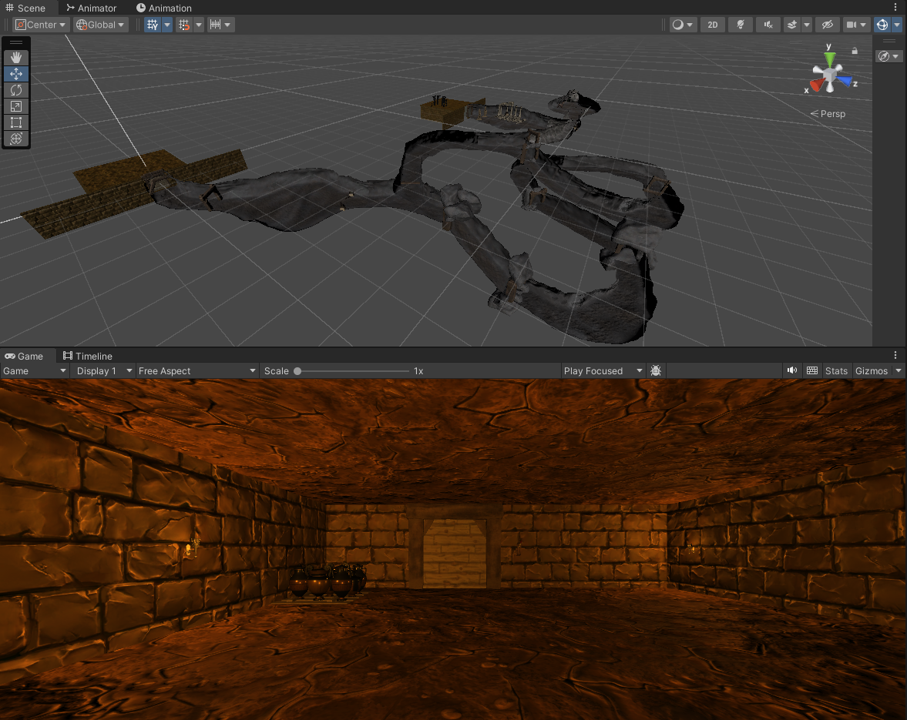

# 🛠 Module : Création de l'Univers de "MysteriesOfEgypt"

## À la Découverte des Objets du Jeu
Dans cette partie de notre aventure pédagogique, nous allons explorer ensemble les objets qui vont peupler les cavernes mystérieuses de notre jeu. Chaque objet a son importance et ajoute à l'immersion et au gameplay. Prépare-toi à te transformer en véritable maître de l'environnement de jeu !

## Les Objets à Récupérer

> Cavernes 🏞️ : Les cavernes sont le cœur du jeu, un réseau complexe de tunnels et de pièces où tout se déroule. Elles doivent être assez variées pour surprendre et engager le joueur.
>
> Props (avec lesquels on peut interagir) 🗨️ : Ces objets interactifs, comme des anciens autels ou des statues, peuvent déclencher des dialogues ou des énigmes.
>
> Levier 🕹️ : Un levier peut ouvrir des passages secrets ou activer des mécanismes cachés. Un incontournable pour ajouter du mystère !
>
> Porte 🚪 : Les portes peuvent barrer l'accès à certaines zones ou cacher des chambres secrètes. Elles jouent un rôle clé dans la progression du joueur.
>
> Torche 🔥 : La torche est essentielle pour éclairer le chemin et maintenir l'aspect survie du jeu. Veille à ce que le joueur puisse interagir avec pour allumer ou éteindre la lumière.
>
> Radio 📻 : Un élément moderne qui peut servir à écouter de la musique ou à se repérer dans le noir.
>
> Monstre 🐉 : Les gardiens des trésors. Ils ajoutent une tension palpable et des défis à surmonter pour le joueur.
>
> Livres 📚 : Nous permettrons de créer une énigme à l'intérieur de notre jeu.
>
> Artéfact 🏺 : L'objet de la quête. Doit être impressionnant et intrigant. Sa découverte est le point culminant du jeu.
>
> Objets de Décor 🌿🗿 : Chaque élément de décor, qu'il s'agisse de fresques murales, de plantes desséchées ou de sculptures antiques, contribue à l'atmosphère du jeu. Laisse libre cours à ta créativité !

 Voici un exemple du résultat de LevelDesign que vous pourrez avoir si vous n'avez pas d'idée.

Et voilà pour le mapping des objets de "MysteriesOfEgypt". Chaque objet doit être pensé pour enrichir l'expérience de jeu et plonger le joueur dans une aventure inoubliable au cœur des mystères de l'Égypte.
Maintenant, nous allons passer au codage de votre personnage ainsi que la gestion des pentes glissantes.

[2.PlayerController]()
