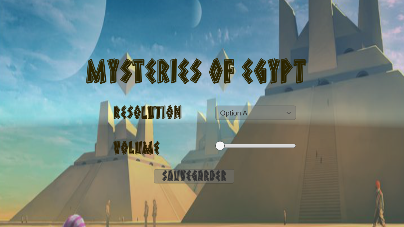

# 🛠️ Options dans les Jeux Vidéo : Volume et Résolution
Dans le monde des jeux vidéo, offrir aux joueurs la possibilité de régler le volume et la résolution est fondamental pour une expérience personnalisée et confortable. Que tu développes un petit jeu indépendant ou une production d'envergure, ces fonctionnalités sont incontournables. Voici pourquoi leur mise en œuvre dynamique est essentielle : 

## 🔈 Le Volume
Non tous les joueurs n'ont pas les mêmes préférences en termes de volume. Certains peuvent être sensibles aux bruits forts, d'autres peuvent préférer jouer avec leur propre musique en arrière-plan. De plus, le volume influence l'ambiance et l'immersion dans le jeu.

Rendre cela dynamique signifie permettre aux utilisateurs de régler le volume général, de la musique, et des effets sonores selon leurs besoins, directement depuis le menu des options. Compléter les parties manquantes de ce code. [VolumeControl.txt](https://github.com/g404-code-gaming/MysteriesOfEgypt/files/14333982/VolumeControl.txt)

Déposer le code dans l'objet slider pour le volume.

## 📐 La Résolution
La diversité du matériel informatique est telle que permettre aux joueurs de modifier la résolution du jeu est une nécessité. Cela peut affecter non seulement l'apparence visuelle du jeu mais aussi sa performance sur des ordinateurs moins puissants.

Rendre cela dynamique signifie proposer différentes résolutions et modes d'affichage (comme le plein écran ou la fenêtrée) adaptés à la variété des écrans et des préférences des joueurs. Compléter les parties manquantes de ce code. [Resolutionsettings.txt](https://github.com/g404-code-gaming/MysteriesOfEgypt/files/14334017/Resolutionsettings.txt)

Déposer le code dans l'objet DropDown pour la résolution.

## 🚀 Pourquoi C'est Important ?
En rendant ces options dynamiques, tu t'assures que ton jeu peut s'adapter à tout type d'ordinateur et à toutes les préférences des joueurs. Cela contribue à une expérience utilisateur positive, renforçant ainsi l'accessibilité et l'inclusivité de ton jeu.

Comment Implementer ? Utilise des éléments UI dans Unity pour créer des curseurs pour le volume, des listes déroulantes pour la résolution, et assure-toi de tester sur différentes configurations pour valider que ces réglages fonctionnent comme prévu.

