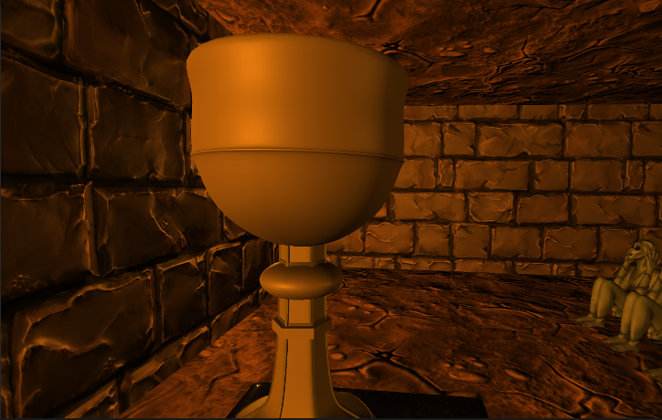

# Cinématique de Fin 🏁
## À la Découverte de la Timeline 🎬
1. Lance-toi dans le menu Window > Sequencing > Timeline. 🌟
2. Choisis un GameObject comme chef d'orchestre 🎼 de ta cinématique.
3. Clique sur "Create" dans la Timeline pour équiper ton GameObject d'un Playable Director et d'une nouvelle Timeline. 🛠️

## Composer Ta Cinématique 📽️
1. Glisse tes scènes, animations et sons dans la Timeline comme un vrai pro du montage. 
2. Joue avec le timing et l'organisation pour un résultat époustouflant. ⏱️
3. Marque des points clés pour une synchronisation parfaite. 🔑

## Scripting de Déclenchement 💻
1. Utilise un GameObject avec un Collider en Trigger pour héberger ton script "CinematicTrigger". 🎮
2. Complète le script CinematicTrigger avec l'aide des Indices. [CinematicTrigger.txt](https://github.com/g404-code-gaming/MysteriesOfEgypt/files/14342630/CinematicTrigger.txt)
3. Vérifie que le script pointe sur ton PlayableDirector. 🎯
4. À l'entrée du trigger par le joueur, faites démarrer la cinématique avec director.Play(). 🏁

## Test et Ajustements Finaux ✔️
Mets à l'épreuve ta cinématique pour s'assurer qu'elle se lance sans accroc. 

[Audio](https://github.com/g404-code-gaming/MysteriesOfEgypt/blob/main/Cour/14.%20Audio.md)
