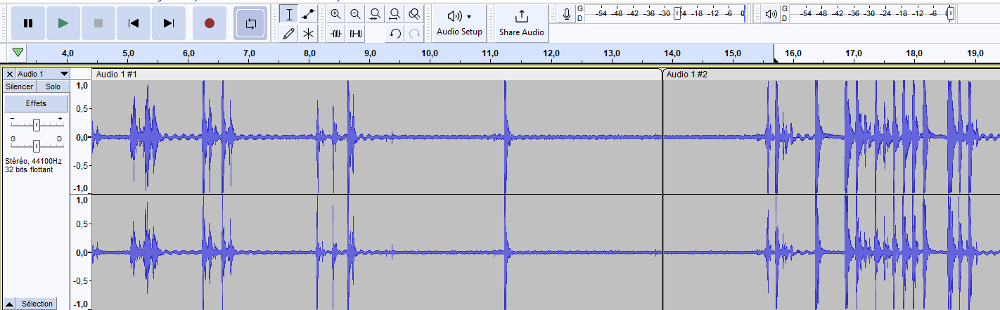

# l'Intégration de Dialogues Audio dans les Jeux avec Audacity 🎤
Introduction :
Donner vie à ton jeu avec des dialogues et des sons interactifs peut transformer complètement l'expérience de tes joueurs. Dans ce module, tu vas apprendre à créer tes propres enregistrements audio pour que tes personnages parlent et interagissent avec les objets dans la map. 🗣️✨

## Découverte d'Audacity
Lance Audacity et familiarise-toi avec l'interface. 🖥️
Expérimente avec les fonctions d'enregistrement, de pause et d'arrêt. 🔴⏸️⏹️
Joue avec les effets pour modifier ta voix (pitch, vitesse, écho...). 🎚️

## Planification du Dialogue
Écris un script pour la conversation ou les interactions que tu souhaites enregistrer pour tes personnages. 📝
Pratique la diction et l'expression avant d'enregistrer pour que ton personnage sonne le plus naturel possible. 🎭

## Enregistrement des Dialogues
Enregistre tes lignes de dialogue en utilisant Audacity, en te rappelant de laisser un petit moment de silence avant et après chaque réplique pour faciliter l'édition. 🎤
Utilise les outils d'édition pour couper les silences inutiles et appliquer des effets si nécessaire. ✂️🎛️

## Exportation et Intégration dans le Jeu
Une fois satisfait de tes enregistrements, exporte-les au format approprié (par exemple, WAV ou MP3). 🔄
Importe les fichiers audio dans ton projet de jeu et programme les interactions pour que ces dialogues se déclenchent lors d'événements spécifiques. (Par exemple, quand un joueur touche un certain objet ou entre dans une zone précise de la map). 🎲
