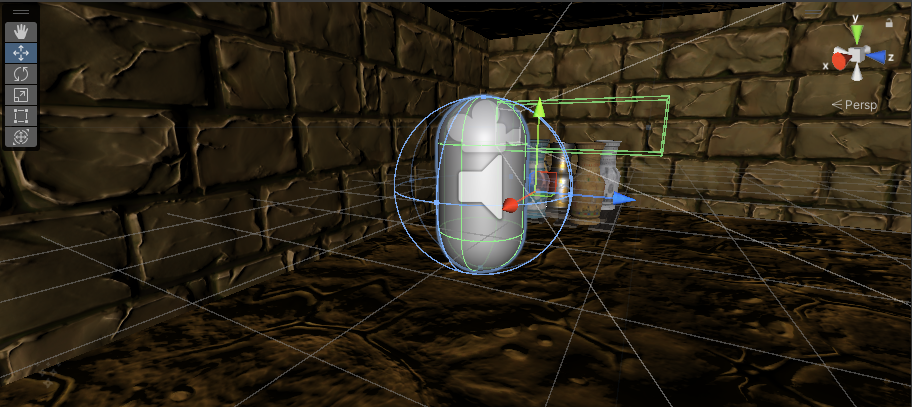
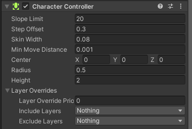

# 🎮 Module : Le Player Controller de "MysteriesOfEgypt"
## Le Rôle du Player Controller
Dans le cœur de notre aventure, le Player Controller est la clé qui relie le joueur au monde de "MysteriesOfEgypt". C'est par ce biais que le joueur peut se déplacer, interagir et explorer les mystérieuses cavernes qui composent notre univers. Un Player Controller bien conçu offre une expérience fluide et intuitive, permettant aux joueurs de se plonger complètement dans l'aventure.

## 🛠 Préparation dans Unity
Avant d'introduire le code qui donnera vie à notre Player Controller, il est essentiel de préparer notre scène dans Unity. Cette étape permet de poser les bases nécessaires pour intégrer notre script de contrôle de personnage. Voici les étapes à suivre :

1. Création du personnage
- Ouvre ta scène dans Unity et clique droit dans la fenêtre Hierarchy.
- Sélectionne CreateEmpty. Celui-ci contiendra notre tout, nos objets liés a notre personnage. Renomme-la "PlayerController".
- Réouvre ta scène dans Unity et clique droit dans la fenêtre Hierarchy sur l'Empty PlayerController.
- Sélectionne 3D Object > Capsule. Cette capsule représentera notre personnage dans le jeu. Renomme-la "Player".

2. Ajout du Component CharacterController
- Sélectionne l'empty "PlayerController" dans la fenêtre Hierarchy.
- Dans la fenêtre Inspector, clique sur Add Component.
- Cherche CharacterController et ajoute-le au "PlayerController". Le CharacterController permettra de gérer les déplacements et interactions avec l'environnement du jeu.

3. Configuration de base
- Positionne la capsule "Player" à l'endroit souhaité dans ta scène comme point de départ.
- Tu peux également ajuster la taille de la capsule dans la fenêtre Inspector pour qu'elle corresponde mieux à la taille que tu imagines pour ton personnage.

4. Préparation pour le script FpsController
Finalement, assure-toi que la scène est prête à recevoir le script FpsController que nous allons créer. Ce script sera attaché à notre "PlayerController" et contrôlera tous les mouvements et actions possibles.

## Implémentation du FpsController
Le FpsController est le composant qui permettra à nos explorateurs de naviguer avec agilité dans les dédales de notre jeu. Voici un exemple simplifié que tu pourras ajuster selon les besoins spécifiques de "MysteriesOfEgypt". 

(Telecharge le fichier et complète le code)  [code.txt](https://github.com/g404-code-gaming/MysteriesOfEgypt/files/14109015/code.txt)

Dans cet exemple, les "___" doivent être remplacés par les mots ou expressions appropriés. Nous avons laissé des indices sous forme de commentaires pour guider vos élèves dans cette démarche. Le but est de leur permettre de comprendre le fonctionnement interne d'un Player Controller tout en les incitant à réfléchir et à appliquer leurs connaissances.

## Conclusion
Le Player Controller est le lien entre le joueur et le monde du jeu. Il est essentiel de le rendre aussi réactif et intuitif que possible pour une expérience de jeu immersive. Cet exercice a pour but de vous familiarisez avec les concepts clés du développement de jeu sous Unity, tout en stimulant vos capacités à résoudre des problèmes.
Ensuite, place a l'interaction des objet avec notre player.
[InteractionPlayer](https://github.com/g404-code-gaming/MysteriesOfEgypt/blob/main/Cour/3.Flambeau.md)

