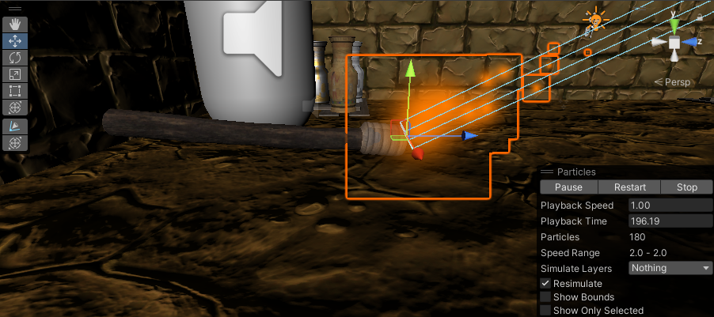

# 🔥 Module : Illuminer le Chemin avec une Torche
## Importation d'un Flambeau 📦
Téléchargement d'un Flambeau : Avant tout, trouve un modèle de flambeau qui te convient sur un site comme Unity Asset Store ou similar. Une fois trouvé, télécharge-le et importe-le dans ton projet Unity.

## Création de Particules pour le Feu 🔥
### Ajout du Système de Particules 
C'est le moment de donner vie à notre flambeau! Dans Hierarchy, clique droit et sélectionne Effects > Particle System. Nomme-le "Fire".

### Configuration des Particules 
- Avec l'option Particle System dans Inspector, joue avec des réglages tels que Start Speed, Start Size, et surtout Start Color pour obtenir une flamme réaliste et chaleureuse.
- Positionne-le astucieusement pour qu'il semble sortir du flambeau.

## Ajout de Lumière 💡
### Création de la Lumière 
L'ambiance, ça compte! Ajoute une source de lumière en cliquant droit dans Hierarchy puis Light > Point Light. Appelle-la "TorchLight".

### Configuration de la Lumière :
- Mets cette source près de ou sur le flambeau pour simuler la lumière émise par la flamme.
- Joue sur Range et Intensity, et opte pour une teinte jaune-orange pour un effet plus vrai que nature.

# ⏳ Module : La Durée de Vie de la Torche et son Renouvellement
## Gestion de la Torche 🔥
Dans ce module, nous allons apprendre à gérer la lumière dans le noir à travers le mystérieux comportement de notre torche. Prêts à allumer la flamme de la curiosité ? Découvrons ensemble comment notre torche éclaire notre chemin avant de s'éteindre lentement, et ce que nous devons faire pour continuer à explorer sans fin. C'est votre moment de briller en programmation, à vous de jouer ! 🔥

[Torch.txt](https://github.com/g404-code-gaming/MysteriesOfEgypt/files/14109635/Torch.txt)

Indices :
- "flame"  pour la référence à l'objet de flamme.
- "spawnPoint"  pour le point où la torche peut être rallumée.
- "burnTime"  pour le temps de combustion.
- "burnCoroutine" pour la coroutine gérant la combustion.
- "StartCoroutine" et "StopCoroutine" pour démarrer et arrêter les coroutines.
- "Mettre à jour" pour l'action à réaliser dans la boucle while.
- "extinguishTorch" pour la méthode appelée à la fin de la combustion.
- "Désactiver" comme action à effectuer dans extinguishTorch.

## Conclusion 🎉
Et voilà! En combinant un beau modèle de flambeau, en secouant ton jeu avec un système de particules flamboyant, et en apportant une touche lumineuse, ta torche est prête à éclairer tout chemin sombre et à enrichir l'atmosphère de ton jeu. 
