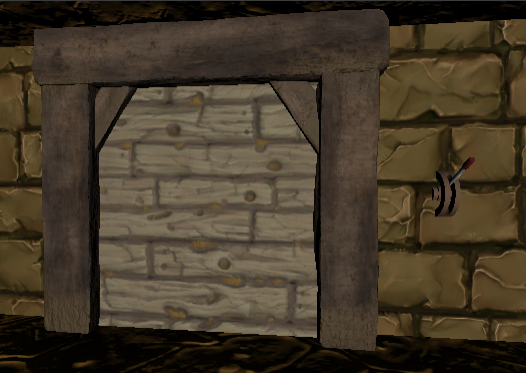

# 🛠️ Intégration d'Interactions avec Levier dans Unity 🚪🕹️

Dans cette partie du cours, on va plonger dans un élément de gameplay classique mais super gratifiant : ouvrir une porte à l'aide d'un levier. Imagine l'excitation de résoudre une énigme ou de découvrir un secret en activant un simple mécanisme ! Pour rendre cette expérience réelle dans Unity, nous allons suivre plusieurs étapes clés, à la fois dans notre script et directement dans l'éditeur Unity. 

## Préparation des Assets et des Animations
 🎞️: Avant de se lancer, assure-toi d'avoir les assets nécessaires. Il nous faut un modèle de levier et de porte, chacun avec sa propre animation. Pour le levier, une animation de "tirage" et pour la porte, une animation d'ouverture.

 

## Configuration des Animateurs
 🎭: Dans l'éditeur Unity, attache des "Animator" à tes objets levier et porte. Crée ensuite des "triggers" dans leurs "Animator Controllers" pour déclencher les animations. Nomme-les intuitivement, par exemple, "Pull" pour le levier et "Open" pour la porte.

## Scripting et Interactivité
 💻: Concernant le code, tu vas te servir du script OpenWithLever qu'on a épicé de « trous ». Ce script va gérer la logique pour afficher le texte d'interaction, activer l'animation du levier, ouvrir la porte et gérer l'état interactif.

 [OpenWithLever.txt](https://github.com/g404-code-gaming/MysteriesOfEgypt/files/14210543/OpenWithLever.txt)

## Intégration dans la Scène
 🌍: Pour mettre en œuvre tout ça, place tes objets dans la scène. Assure-toi que le levier et la porte soient bien positionnés et que les animations se jouent comme prévu. Joue la scène pour tester l'interaction et ajuste si nécessaire. (Oublie pas si tu veux interagir avec ton levier, il lui faut un rigidbody ainsi qu'un box collider)

 🎮: N'oublie pas d'ajouter une UI pour signaler au joueur quand il peut interagir avec le levier. Ça peut être un simple texte ou une icône qui apparaît à l'écran (Reprenez le inttext de votre UI).

[BONUS: Radio](https://github.com/g404-code-gaming/MysteriesOfEgypt/blob/main/Cour/6.Radio.md)
