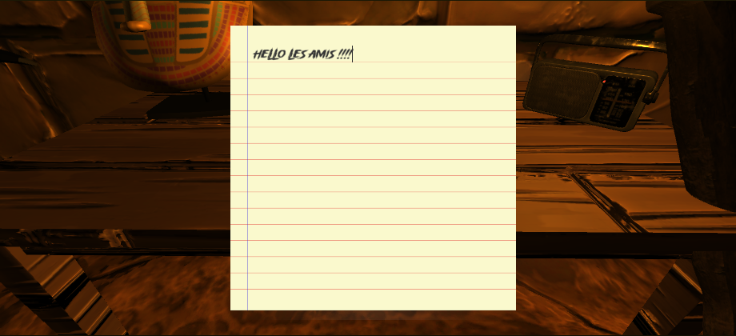

# Créer un Notepad dans Unity ✍️

Dans cette session, on va plonger dans les mystères d'Unity pour créer quelque chose de super cool et ultra utile : un Notepad interactif ! 🚀 Ce n'est pas juste un petit exercice ; c'est une vraie exploration de l'imagination. Imagine un joueur qui peut prendre des notes dans le jeu, marquant des idées ou des indices. C'est ce qu'on va construire ensemble.👷‍♂️💼

Avec le code qu'on a préparé, mais attention... il y a quelques "trous" que tu devras combler. 🕳️🛠️ C'est une chance en or pour toi de mettre à l'épreuve tes talents de détective- développeur. Ne t'inquiète pas, on laisse pas un détective sans indices. Pour chaque trou, un indice sera là pour guider ta réflexion et t'aider à trouver la solution 🕵️‍♂️🔍

Prépare-toi à explorer les concepts d'interaction en jeu, la gestion de l'UI, et bien sûr, la programmation avec Unity. C'est un atelier qui te donnera non seulement les compétences pour créer un bloc-notes dans tes projets, mais qui t'ouvrira aussi les portes à une infinité de possibilités d'interaction dans tes futurs jeux. 🌈🎮

1. Mise en Place du Bloc-note UI 📝:
Dans l'éditeur Unity, va dans le menu "GameObject" > "UI" pour créer les éléments UI nécessaires, comme une image qui agira comme le notepad 🗒️ et un InputField pour la saisie 🖊️.
Personnalise ces éléments pour qu'ils correspondent au look que tu vises pour ton notepad 🎨.

2. Scripting 💻:
Crée un nouveau script C# nommé "NotePad" ou un nom de ton choix 📄.
Copie le code fourni dans ce script en remplaçant les "trous" par les bonnes implémentations en te basant sur les indices 🔍.
[NotePad.txt](https://github.com/g404-code-gaming/MysteriesOfEgypt/files/14219700/NotePad.txt)
Assure-toi d'attacher ce script à un GameObject dans ta scène qui représente ton bloc note 👾.

3. Configuration du Script 🎚️:
Dans l'inspecteur Unity, avec le GameObject qui a le script attaché sélectionné, lie les éléments UI créés précédemment aux variables publiques du script. Cela permettra de contrôler l'UI du bloc-note depuis le script 🕹️.

4. Fonctionnalités Clé 🔑:
Afin d'indiquer que le joueur peut interagir avec, on rajoutera le code "interact" sans ajouter de texte à l'intérieur.
Oublie pas de rajouter un rigidbody et un box collider pour que l'on puisse interagir avec celui-ci.

# 🎉 Mission Accomplie : Le Notepad Interactif est Né ! 🎉

Et voilà ! Tu viens de franchir une étape majeure en ajoutant une touche personnelle et interactive à ton jeu avec ce notepad. Ce n'était pas juste une session de programmation ordinaire, c'était un véritable voyage dans l'univers de la création. 🌌✨
