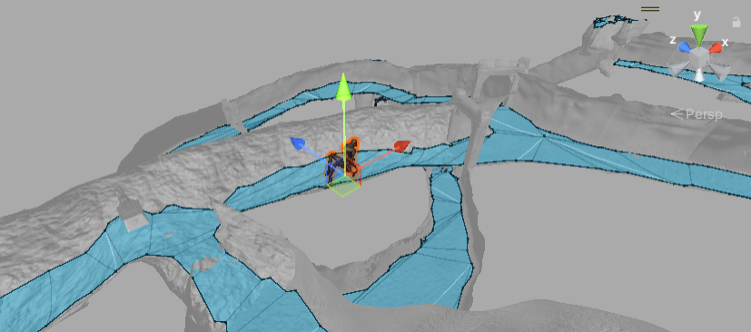

# Analyse du concept d'IA 🤖:
Plonge au cœur de l'IA: quel rôle joue-t-elle ? Est-ce un challenger de poids ou juste un figurant ? 🎭
Détermine ses mouvements : patrouille 🚶‍♂️, poursuite 🏃‍♀️, attaque ⚔️, etc.

###  1. Intégration du NavMeshAgent :
Avant de plonger dans le script, il faut préparer le terrain. 🏗️
Ajoute un NavMeshAgent à ton objet ennemi. Cela permettra à ton IA de se déplacer intelligemment dans l'environnement. 🧭

### 2. Détermination des terrains navigables 🗺️:
Avec le NavMeshAgent prêt, le moment est venu de définir les zones accessibles (walkable) et inaccessibles (not walkable).
Utilise les outils de navigation de Unity pour peindre les zones walkable directement sur ta scène. Cela guidera ton IA dans ses déplacements, en évitant les obstacles et en naviguant vers le joueur ou ses objectifs.

### 3. Création de l'IA ennemie 👾:
Donne vie à ton IA en ajoutant un nouvel objet ennemi dans la scène. 🛸
Équipe cet objet avec un Rigidbody pour le mouvement et un Collider pour détecter les chocs. 💥

### 4. Scripting de base 📝:
Lance-toi dans la programmation avec un nouveau script C# nommé AiEnemy. 🖥️
[IAEnemy.txt](https://github.com/g404-code-gaming/MysteriesOfEgypt/files/14222191/IAEnemy.txt)

### 5. Configurer les paramètres de l'IA ⚙️:
Paramètre ton IA : états (patrouille, poursuite, idle) et variables (vitesse, points de patrouille…). 🎚️
Applique des valeurs par défaut pour démarrer en douceur. 🚦

### 6. Programmation des comportements 👨‍💻:
Entre dans la valse des états : quand patrouiller, quand poursuivre et quand rester au calme. 💃🕺
Utilise des conditions et des événements pour dynamiser le gameplay. ⚡

[AttackMonster](https://github.com/g404-code-gaming/MysteriesOfEgypt/blob/main/Cour/9.AttackMonster.md)
