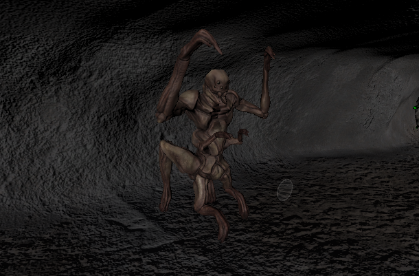

# Intégration du Script d'Attaque dans Unity 🎮

## Étape 1 : Importation et Préparation du Script👨‍💻

Création du Script : Si ce n'est pas déjà fait, commence par créer un script C# nommé AttackEnemy. Copie le code fourni dans ce script. [AttackEnnemy.txt](https://github.com/g404-code-gaming/MysteriesOfEgypt/files/14328586/AttackEnnemy.txt)

Ajout du Script à un Objet : Crée un nouvel objet vide dans ta scène Unity. Clic droit dans l'hierarchie > Créer > Objet vide. Nomme-le EnemyTrigger.

Attachement du Script : Glisse le script AttackEnemy sur l'objet EnemyTrigger dans l'éditeur.

## Étape 2 : Configuration des Composants 🔧

Ajout d'un Collider : Pour que l'objet puisse détecter le joueur, ajoute-lui un composant Box Collider (ou autre selon la forme souhaitée). Assure-toi de cocher l'option Is Trigger pour que le collider agisse comme un déclencheur.

Paramétrisation du Script : Sélectionne l'objet EnemyTrigger et tu verras dans l'inspecteur les champs à remplir pour le script AttackEnemy. Utilise le glisser-déposer pour lier les composants demandés (Animator, GameObject player, etc.) depuis l'hierarchie ou directement depuis la vue projet si tu as des préfabriqués.
    
Animator : Lie l'objet qui contient l'animation de jumpscare.
GameObject player : Lie l'objet qui représente le joueur.
GameObject Camera : Lie la caméra spécifique qui sera activée lors de l'attaque.

## Étape 3 : Création d'une Cinématique d'Attaque 🎬

Ajout de la Caméra : ajoute la caméra dans ta scène Unity qui sera attachée à notre monstre et désactive là.

Création de l'Animation : Avec la caméra sélectionnée, ouvre l'onglet "Animation" (Fenêtre > Animation > Animation).

Mode Enregistrement : Assure-toi que le bouton d'enregistrement (le rond rouge) est activé dans l'onglet Animation.

Positions Clés : Déplace ta caméra pour simuler le mouvement de recul ou de secousse dû à l'attaque. Utilise les frames pour délimiter le début et la fin de l'animation. 🛤  🎥

## Étape 4 : Test et Ajustements 🛠️

Test : Lance le jeu et teste si l'interaction fonctionne comme prévu. Quand le joueur entre dans le zone du EnemyTrigger, le joueur devrait dispa
raître, la caméra de l'attaque s'activer, puis l'animation de jumpscare se déclencher.

Ajustements : Si nécessaire, ajuste la position et la taille du collider, ainsi que les paramètres du script pour peaufiner l'expérience.
